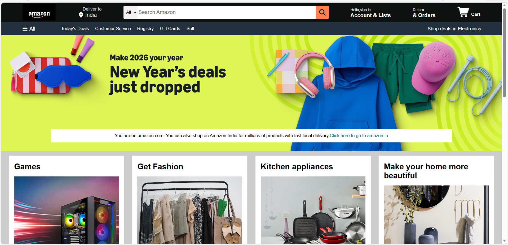

🛒 Amazon Homepage Clone

A front-end clone of the Amazon homepage built using HTML5 and CSS3.
This project replicates the layout and design of the homepage of Amazon for learning and practice purposes.

📌 Project Overview

This project focuses on recreating the user interface of the Amazon homepage to strengthen front-end development skills. It includes a responsive navigation bar, hero section, product category boxes, and a structured footer.

The goal of this project was to practice:

Layout structuring

Flexbox alignment

Styling components

Hover effects

Icon integration using Font Awesome

🚀 Features

✅ Responsive Navigation Bar

✅ Location & Account Section

✅ Search Bar with Category Dropdown

✅ Hero Section with Promotional Message

✅ Product Category Grid Layout

✅ Styled Footer with Multiple Sections

✅ Font Awesome Icons Integration

✅ Hover Effects for Interactive UI

🛠️ Technologies Used

HTML5

CSS3

Flexbox

Font Awesome (CDN)

🎯 Learning Outcomes

Through this project, I learned:

How to structure large web layouts

Effective use of CSS Flexbox

Styling reusable components

Designing clean and organized UI

Creating multi-section web pages

⚠️ Disclaimer

This project is a non-commercial educational clone created for learning purposes only.
It is not affiliated with or endorsed by Amazon.

🌐 Future Improvements

Make it fully responsive for mobile devices

Add login & signup page

Add shopping cart functionality using JavaScript

Add product detail pages

Improve UI animations

👩‍💻 Author

Khushi Kumari
Front-End Developer (Beginner)
Passionate about learning and building web projects 🚀
